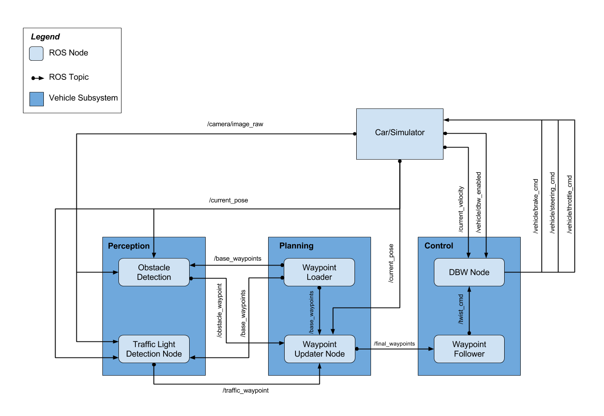

## Flow-Chart

___
## System Architecture 
Here is a system architecture diagram showing the ROS nodes and topics used in the project.

  

## Traffic Light Detection

---
### path -> 
/ros/src/tl_detector/
### Function -> 
Calculate where to stop at a red traffic light

  

#### tl_detector.py: 
Traffic light detection
#### tl_classifier.py: 
Classification

## Waypoint

---
### path ->
/ros/src/waypoint_updater/
### Function -> 
It updates the target speed attribute for each waypoint based on traffic light and obstacle detection data. Post a list of waypoints in front of the vehicle with each target speed.

  

## Control

---
### path ->
/ros/src/twist_controller/
### Function -> 
Configure throttle, brake and steering to match linear and angular speed to desired values

  

