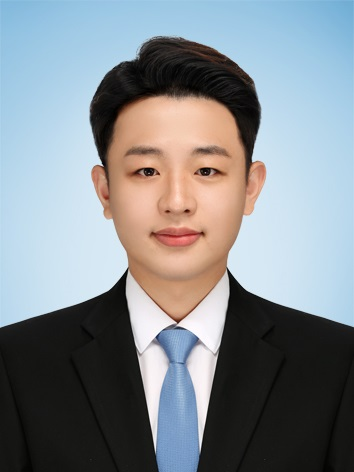
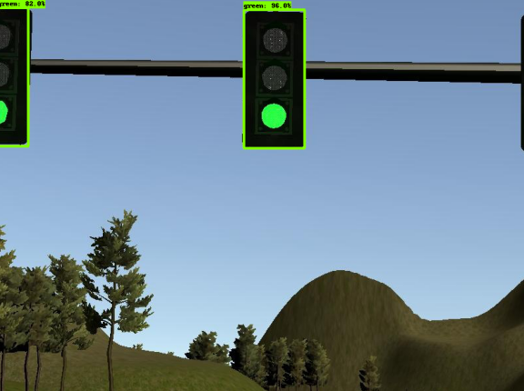
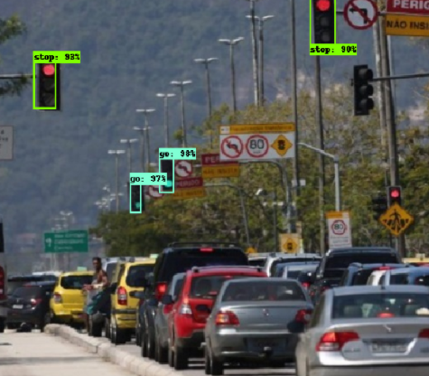

# Udacity Self-Driving Car Nanodegree: System Intergation


In this project, we should integrate of the projects what we learned.
This project got some missions like
- Detecting traffic lights
- Stopping if the light is red
- Successfully navigate(waypoints) with steering and breaks
- Controlling throttle of CARLA

In this project, my Colleagues and I developed System Integration which Autonomous Driving on CALRA Simulation.
After finished this task, we've more information and knowledge about Autonomous driving tasks.
Truly thankful to Udacity program because while working on this project, I found that each person's ability is important,
but more importantly, Communication.

Lastly, I'd like to thank you to the Colleagues. If without them, I would never finished this project.

## Team [Inha Leica]

---
|     Image              |     Role      |      Name      |     email   |
|------------------------|---------------|----------------|-------------|
| |__Lead__|Min-Su Kang|ziz1945@naver.com|
| | - |Sang-Hoon Ahn|22171365@inha.edu|
| | - |Dong-Hyuk Park|qkrehdgursla@gmail.com|
| | - |Dong-Joo Lee|djkang1ee@naver.com|

### Introduction
__Min-Su Kang:__ The master's course student. Interest in Machine Learning, Localization and Autonomous Driving.

__Sang-Hoon Ahn:__ The Ph.D. student. Interest in Control and Autonomous Driving.

__Dong-Hyuk Park:__ The master's course student. Interest in Control and Autonomous Driving.

__Dong-Joo Le:__ The master's course student. Interest in Decision, Localization and Autonomous Driving.


## Traffic Light

---
Suppose there is only one traffic light color in the CARLA field of view at the same time At this point, the classifier selects the color of the traffic light with the highest score, and if less than 50% probability is detected, the classification function returns Unknown. CNN is used for detection, and Tensorflow Object Detection AIP is used based on COCO Dataset. In addition, SSD and Faster-RCNN models were used as detection models.

### Dataset
The data set used for classifier training is [280 images from Udacity, 710 images recorded on autonomous cars]. 
we had to convert all images from my manually labeled dataset to TFRecord format.

### Train
We trained the classifier for the simulator and real classifier, the parameters are as follows:
- num_classes: 4 ('Green','Red','Yellow','Unknown')
- num_steps: 10000
- max_detections_per_class: 10

### Validation
The trained classifier was verified using 20 images, and it was confirmed that both were detected correctly.



## Control

---
Motor vehicle operation is done with normal driving and braking by FSM. It drives where no traffic light is detected or when the traffic light is green, and you can drive with the speed set as default. When detecting a red traffic light, calculate the minimum braking distance. The braking deceleration is then applied according to the current speed and distance, and all speeds between the vehicle and the traffic light are smoothly reduced to zero at the traffic light. All speeds in front of the traffic lights are set to zero.


When a red traffic light starts to be detected, the vehicle starts braking. Also, if the traffic light turns green in the middle, you can see that the vehicle is driving at a normal speed. The throttle and brake pedal are controlled by PID as shown below.

####P: 0.8
####I: 0.0001
####D: 0.01

## Install

---
### Native Installation

* Be sure that your workstation is running Ubuntu 16.04 Xenial Xerus or Ubuntu 14.04 Trusty Tahir. [Ubuntu downloads can be found here](https://www.ubuntu.com/download/desktop).
* If using a Virtual Machine to install Ubuntu, use the following configuration as minimum:
  * 2 CPU
  * 2 GB system memory
  * 25 GB of free hard drive space

  The Udacity provided virtual machine has ROS and Dataspeed DBW already installed, so you can skip the next two steps if you are using this.

* Follow these instructions to install ROS
  * [ROS Kinetic](http://wiki.ros.org/kinetic/Installation/Ubuntu) if you have Ubuntu 16.04.
  * [ROS Indigo](http://wiki.ros.org/indigo/Installation/Ubuntu) if you have Ubuntu 14.04.
* Download the [Udacity Simulator](https://github.com/udacity/CarND-Capstone/releases).

### Docker Installation
[Install Docker](https://docs.docker.com/engine/installation/)

Build the docker container
```bash
docker build . -t capstone
```

Run the docker file
```bash
docker run -p 4567:4567 -v $PWD:/capstone -v /tmp/log:/root/.ros/ --rm -it capstone
```

### Port Forwarding
To set up port forwarding, please refer to the "uWebSocketIO Starter Guide" found in the classroom (see Extended Kalman Filter Project lesson).

### Usage

1. Clone the project repository
```bash
git clone https://github.com/udacity/CarND-Capstone.git
```

2. Install python dependencies
```bash
cd CarND-Capstone
pip install -r requirements.txt
```
3. Make and run styx
```bash
cd ros
catkin_make
source devel/setup.sh
roslaunch launch/styx.launch
```
4. Run the simulator

There are a total of two classifiers, SSD and RCNN classifier. First, to use an SSD, enter the following.
```bash
roslaunch launch/styx.launch model:='frozen_inference_graph_simulation_ssd.pb'
```
Second, to use an RCNN, enter the following.
 ```bash
roslaunch launch/styx.launch model:='frozen_inference_graph_simulation_rcnn.pb'
```

### Real world testing

1. Download [training bag](https://drive.google.com/file/d/0B2_h37bMVw3iYkdJTlRSUlJIamM/view?usp=sharing) that was recorded on the Udacity self-driving car (a bag demonstraing the correct predictions in autonomous mode can be found [here](https://drive.google.com/open?id=0B2_h37bMVw3iT0ZEdlF4N01QbHc))

2. Unzip the file
```bash
unzip traffic_light_bag_files.zip
```
3. Play the bag file
```bash
rosbag play -l traffic_light_bag_files/loop_with_traffic_light.bag
```
4. Launch your project in site mode
```bash
cd CarND-Capstone/ros
roslaunch launch/site.launch model:='frozen_inference_graph_real.pb'
```
